# LinkedIn Job Search with OpenAI Language Model

This GitHub project combines Azure Functions, Azure Cosmos DB, and Azure Storage to scrape LinkedIn job listings and extract information using OpenAI's Language Model.

It is meant as a personal project to play around with the LinkedIn API, see what can be done with LLMs to extract insights from the free text that are the job listings and also test the Azure Functions V2 model for Python with Durable Functions.


## Disclaimer
LinkedIn's API is not public, and web scraping may violate its terms. Use this code at your own risk, ensuring compliance with LinkedIn's policies. It is meant for personal use only as a POC.

This is making use of https://github.com/tomquirk/linkedin-api, which is not hosted in PyPI and is installed from source. It will use your credentials to access the LinkedIn API, so review the code carefully before use.


## Prerequisites
- Azure subscription
- Azure Function App
- Azure Cosmos DB instance with a database `linkedinjobs` (right now the database and containers are hardcoded).
- Azure Storage account
- OpenAI API key
- Cookies for a logged in LinkedIn account. See this issue for more details https://github.com/tomquirk/linkedin-api/issues/331

You can use the free tier of azure for the Azure Function and Cosmos DB, but the Storage Account and the OpenAI API will incur in costs. 

## Setup

To run it locally you need:

1. Clone the repository.

2. Set up the environment to run azure functions, if running in VS Code, you should be prompted to setup for an azure function.

3. Upload cookies to the storage account to a container `config` and the file named `cookies_alternative.json`

3. Add the `local.settings.json` with the updated values for your resources.

4. Start the function with `func start`

5. Trigger the http endpoint `http://localhost:7071/api/orchestrators`

If everything runs correctly you can deploy it through VS Code itself, as well as uploading the settings.

### local.settings.json
```json
{
  "IsEncrypted": false,
  "Values": {
    "FUNCTIONS_WORKER_RUNTIME": "python",
    "AzureWebJobsStorage": "YOUR_LOCAL_AZURE_STORAGE_CONNECTION_STRING",
    "AzureWebJobsFeatureFlags": "EnableWorkerIndexing",
    "OPENAI_API_KEY": "YOUR_OPENAI_API_KEY",
    "CosmosConnection": "YOUR_COSMOS_DB_CONNECTION_STRING",
    "APPLICATIONINSIGHTS_CONNECTION_STRING": "YOUR_APPLICATION_INSIGHTS_CONNECTION_STRING",
    "OrchestratorStatusUri": "YOUR_ORCHESTRATOR_STATUS_URI"
  }
}
```

Replace placeholders with your actual configuration values. Most of them are self-explanatory or standard for Azure Functions. `OrchestratorStatusUri` is a URL to send a POST request with the status of orchestrators after it finishes.

## Folder Structure
- `jobsearch/`: Modules for the different APIs used.
- `function/`: Durable entities and other functions.
- `tests/`: At the moment only one openai test for the prompt.
- `function_app.py`: Main entry point of the azure functin.

## Usage
The Azure Function will automatically query LinkedIn, process data, and store results in Cosmos DB. Use stored data as needed.

To customize how it works you can update the queries that are being made to LinkedIn in both the trigger for changing the keyworkds or the `linkedin.py` module for more fine grained control of the parameters.

For the post-processing done by the LLM, you will need to update both the prompts at `openai.py` and the models for the job summary at `models.py`

## How it works

The azure functions has two orchestrators and a couple of activities to manage all the workflow. At a high level it queries LinkedIn for the jobs, extracts the job description and parses it using Open AI.

Here is the diagram of the azure function as shown by the az-func-as-graph extension for reference on how the flow works:




To ilustrate the processing of the descriptions, this is an example of how the Open AI extraction would work. For this job for a Quatermaster for the Blackbeard's Crew:

```markdown
Captain Blackbeard's Crew is a renowned group of swashbuckling pirates operating in the Mediterranean Sea. We specialize in high-seas adventures, treasure hunts, and thrilling escapades. Our crew is known for its camaraderie, daring spirit, and love for the open waters.

Are you ready to embark on a daring career as a Quartermaster Pirate in the Mediterranean? Join our crew and be part of a legendary pirate adventure! As the Quartermaster, you will play a crucial role in maintaining order and ensuring the smooth operation of our pirate ship.

## Key Responsibilities:

1. **Crew Management**: As the Quartermaster, you'll oversee the crew, assigning duties, and maintaining discipline on board. Your leadership ensures that everyone is working together efficiently.

2. **Supplies and Provisions**: Manage the ship's supplies, including food, water, and ammunition. Ensure that the crew has everything they need for the voyage.

3. **Navigation**: Assist the ship's navigator in plotting courses and navigating the treacherous Mediterranean waters. Your knowledge of maps and charts is essential.

4. **Conflict Resolution**: Mediate disputes among the crew, helping to maintain a harmonious and productive environment.

5. **Booty Distribution**: When treasure is plundered, you'll help distribute the spoils fairly among the crew, keeping morale high.

6. **Combat Readiness**: Ensure that weapons and defenses are in top condition, ready for any skirmish or battle that may arise.

## Qualifications:

- Experience as a sailor or pirate in the Mediterranean.
- Strong leadership and organizational skills.
- Proficiency in navigation, map reading, and sailing.
- Ability to make quick decisions under pressure.
- Excellent interpersonal and conflict resolution skills.
- Fearless spirit and a passion for adventure.

## Benefits:

- Adventure of a lifetime on the high seas.
- Camaraderie with a diverse and passionate crew.
- Opportunities for career advancement within the crew.
- Competitive remuneration from shares of the plundered treasures, commensurate with experience and contribution to our pirate exploits.

## How to Apply:

If you're ready to embrace the pirate's life and become our next Quartermaster, send your application via carrier pigeon (or a modern equivalent). Include your pirate name, a list of your past pirate adventures, and a brief message in a bottle telling us why you're the perfect fit for our crew.

Join Captain Blackbeard's Crew and make history on the Mediterranean waves! A pirate's life awaits you!
```

The output after processing it would be:
```json
{
    "location": "Mediterranean Sea",
    "remote_from_spain": false,
    "salary": "Competitive remuneration from shares of the plundered treasures, commensurate with experience and contribution to our pirate exploits.",
    "role_responsabilities": [
        "Oversee the crew, assigning duties, and maintaining discipline on board.",
        "Manage the ship\"s supplies, including food, water, and ammunition.", "Assist the ship\"s navigator in plotting courses and navigating the treacherous Mediterranean waters.",
        "Mediate disputes among the crew, helping to maintain a harmonious and productive environment.",
        "Help distribute the spoils fairly among the crew, keeping morale high.",
        "Ensure that weapons and defenses are in top condition, ready for any skirmish or battle that may arise."
    ],
    "required_experience": [
        "Experience as a sailor or pirate in the 17th century Mediterranean.",
        "Strong leadership and organizational skills.",
        "Proficiency in navigation, map reading, and sailing.",
        "Ability to make quick decisions under pressure.",
        "Excellent interpersonal and conflict resolution skills.",
        "Fearless spirit and a passion for adventure."
    ],
    "benefits": [
        "Adventure of a lifetime on the high seas.",
        "Camaraderie with a diverse and passionate crew.",
        "Opportunities for career advancement within the crew.",
        "Competitive remuneration from shares of the plundered treasures, commensurate with experience and contribution to our pirate exploits."
    ]
}
```

This json is stored in the Cosmos DB, so it can be queried and used.

## Contributing
Contributions are welcome. Create pull requests for improvements.

## License
This project is under the MIT License. See [LICENSE](LICENSE) for details.